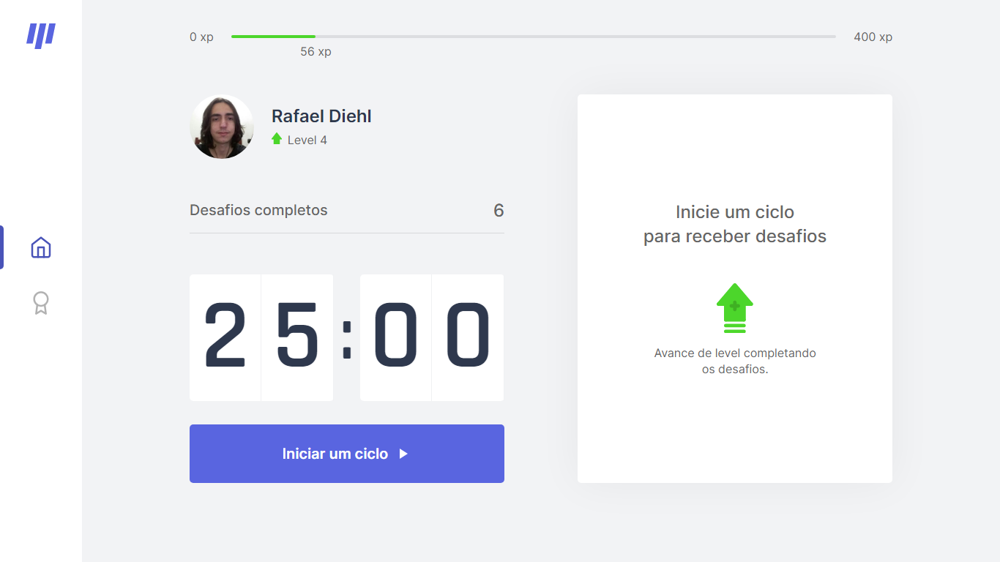
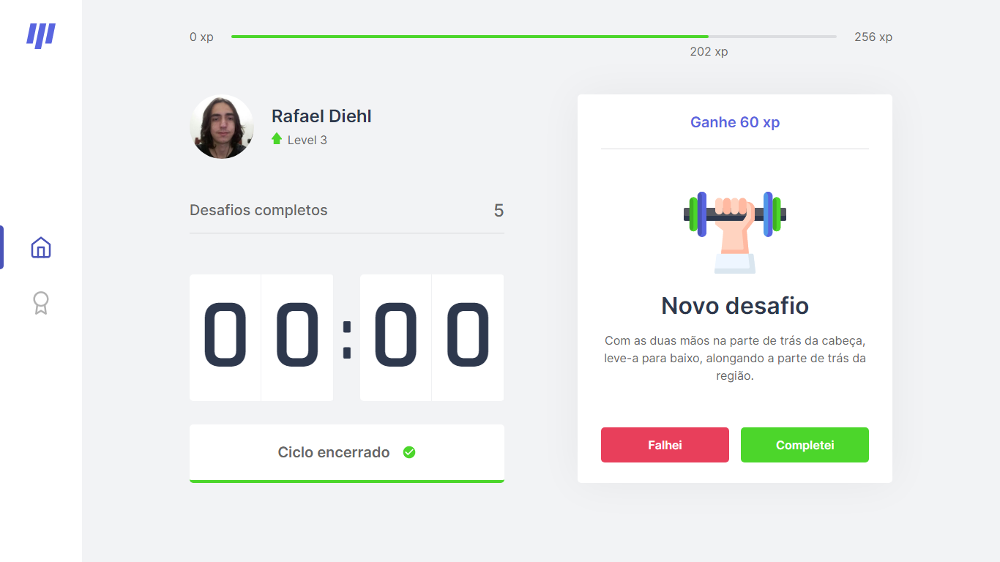
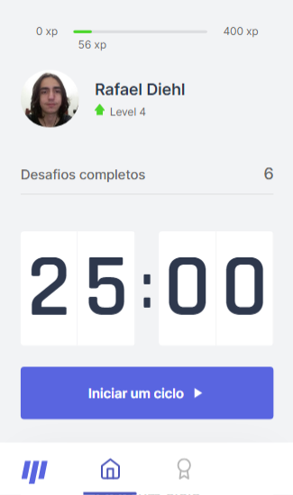
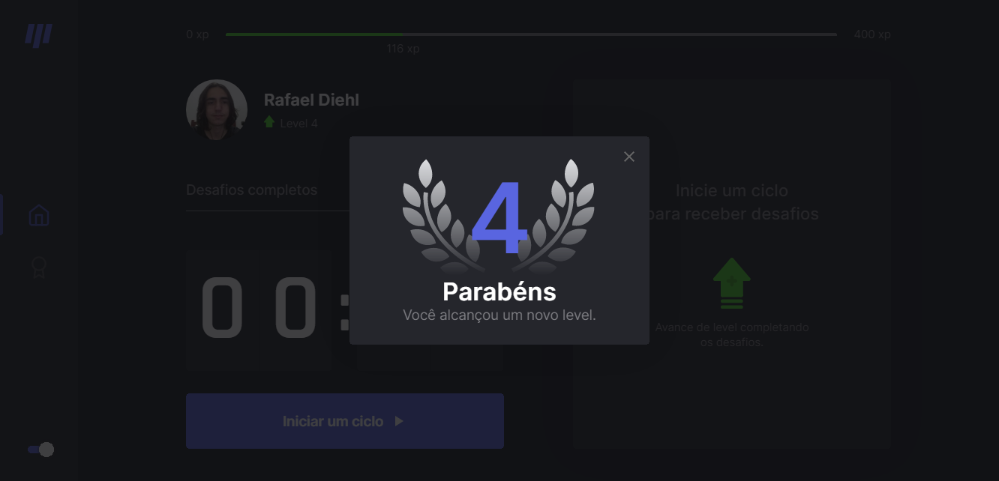

<h1 align="center"></h1>
  
<p align="center">Move.it é um projeto em Next.js que foi desenvolvido durante a NLW #4 🚀</p>

<p align="center">

  <a href="https://rocketseat.com.br/" target="_blank">
    
  </a>

  <a href="https://github.com/rafaeldiehl" target="_blank">
    
  </a>

   

  
  
  
</p>

<h3 align="center"></h3>

### Tabela de Contéudos
<!--ts-->
   * [Sobre](#sobre)
   * [Layout](#layout)
   * [Como usar](#como-usar)
      * [Pré-requisitos](#pre-requisitos)
      * [Instalando localmente](#instalacao)
      * [Funcionamento](#funcionamento)
   * [Tecnologias](#tecnologias)
   * [Features](#features)
<!--te-->

<hr />
<div id="sobre">
  <h2 align="center">📘 Sobre</h2>

  <p>Move.it é uma aplicação web baseada na  <a href="https://pt.wikipedia.org/wiki/T%C3%A9cnica_pomodoro">técnica <i>pomodoro</i></a>, que consiste num cronômetro que divide o tempo em períodos de 25 minutos, separados por pequenos intervalos. Além disso, o Move.it propõe a realização de desafios — divididos entre exercícios para o corpo e visão — para ajudar o usuário a manter uma rotina saudável, premiando-o com pontos de experiência, níveis e contabilizando o número de desafios completados. Foi desenvolvida durante o Next Level Week #4, um evento com duração de uma semana para programadores, promovido pela <a href="https://rocketseat.com.br">Rocketseat</a>.
</div>

<div id="layout">
  <h2 align="center">🖼️ Layout</h2>
  
  <p align="center">
    
    
    
    
    
    
    
    
    
  </p>

</div>

<div id="como-usar">
  
  <h2 align="center">🔎 Como usar</h2>

  É possível visualizar o projeto em produção pela Vercel, <a href="https://move-it-rust-xi.vercel.app">clicando aqui</a>. Porém, caso você queira instalar o projeto diretamente em sua máquina, siga as instruções abaixo.
  
 <div id="pre-requisitos">
  <h3>Pré-requisitos</h3>

  Para conseguir acessar o projeto localmente, certifique-se de ter as seguintes ferramentas instaladas em sua máquina:
  
  - Node.js (obrigatório)
  - Git (opcional)
  - Yarn (opcional)

  Além disto é bom ter um editor para trabalhar com o código, como o <a href="https://code.visualstudio.com">VSCode</a>.

 </div>

<div id="instalacao">
  <h3>Instalando localmente</h3>

  Primeiramente, clone o repositório usando git ou baixe-o como zip:
  
  ```bash
  git clone https://github.com/rafaeldiehl/move.it.git
  ```

  Em seguida, acesse a pasta raiz do projeto:

  ```bash
  cd move.it
  ## Caso tenha baixado como zip e já tenha descompactado
  cd move.it-main
  ```

  Dentro da pasta raiz, instale as dependências:

  ```bash
  npm install
  ## Caso esteja usando yarn
  yarn install
  ```

  Com as dependências já instaladas, inicie o projeto:

  ```bash
  npm run dev
  ## Caso esteja usando yarn
  yarn dev
  ```
    
 </div>
 
 <div id="funcionamentor">
  <h3>Funcionamento</h3>

  Em construção...
 </div>

<div>

<div id="tecnologias">

  <h2 align="center">🛠 Tecnologias</h2>

  As seguintes tecnologias foram usadas na construção do projeto:


  - JavaScript
  - TypeScript
  - JSON
  - Node.js
  - React.js
  - Next.js
  - Styled Components 
  
</div>


<div id="features">

  <h2 align="center">📌 Features</h2>

  Além do projeto criado com as aulas, estão/serão implementadas as seguintes features.
  
   - [x] Adição de ícones
   - [x] Responsividade
   - [x] Página de Login
   - [ ] Página de Leaderboard
   - [ ] Modo escuro
   - [ ] Autenticação com Github
   - [ ] Armazenamento dos dados dos usuários
   - [ ] Compartilhar progresso no Twitter
  
</div>

<hr />

<p align="center">
  Feito com 💙 por <a href="https://github.com/rafaeldiehl">Rafael Diehl</a>
</p>